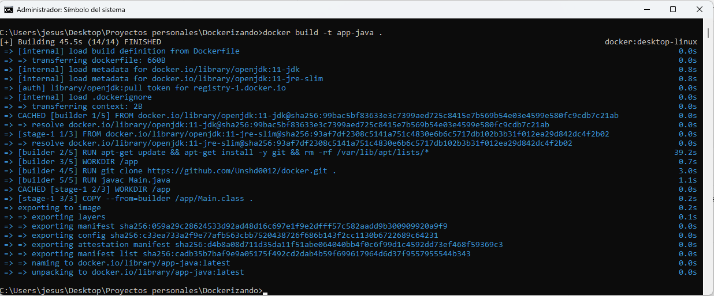
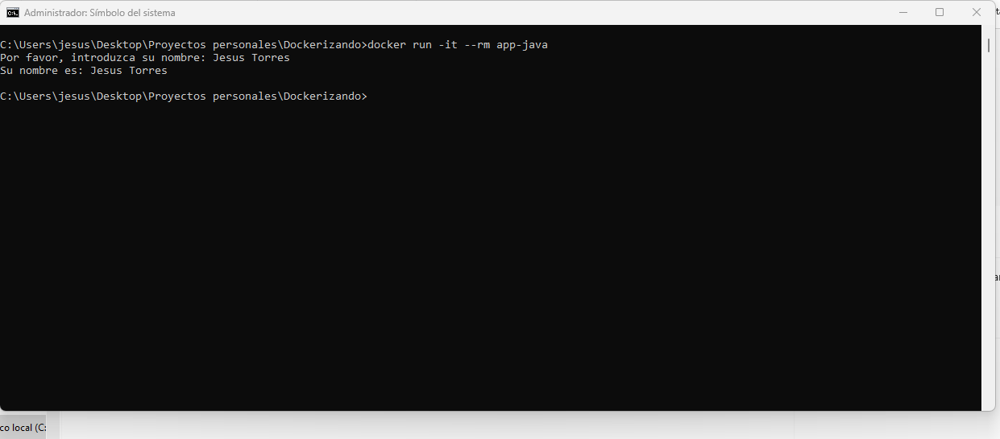

# Proyecto Docker Java

En este proyecto demuestro cómo construir una imagen Docker que, durante el proceso de *build*, realiza los siguientes pasos:

1. **Clonación del repositorio**:  
   Se clona el código fuente desde un repositorio remoto vía HTTPS utilizando Git.

2. **Compilación del código Java**:  
   Se utiliza el JDK 11 para compilar el código Java ( el archivo `Main.java`).

3. **Generación de la imagen de ejecución**:  
   Se crea una imagen Docker basada en `openjdk:11-jre-slim` para ejecutar la aplicación Java compilada.

## Detalles del Proceso

El proceso se implementa mediante un *Dockerfile* con construcción de múltiples etapas (*multi-stage build*):

- **Etapa de compilación (builder)**:  
  Se utiliza la imagen `openjdk:11-jdk`, se instala Git, se clona el repositorio y se compila el código.

- **Etapa de ejecución**:  
  Se utiliza la imagen `openjdk:11-jre-slim`, en la cual se copia el archivo compilado para ejecutar la aplicación.


## Imágenes del Proyecto


1. **Imagen 1:** Proceso de creación de la imagen Docker durante el *build*.
   
   

2. **Imagen 2:** Ejecución del contenedor en funcionamiento, donde se solicita el nombre al usuario y se muestra en pantalla.
   
   

## Cómo Construir y Ejecutar

1. **Construir la imagen Docker**:

   Desde el directorio que contiene el archivo `Dockerfile`, ejecuta:
   ```bash
   docker run -it --rm app-java
